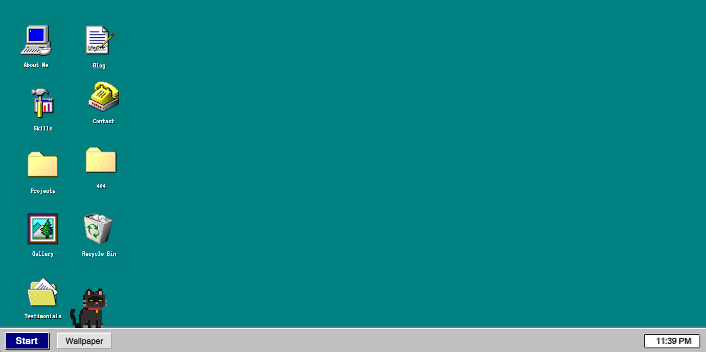
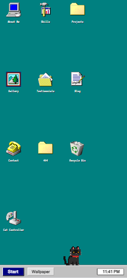

# Windows 95 Portfolio (React)

A retro-themed, fully responsive portfolio web app built with React, designed to authentically mimic the look, feel, and behavior of Windows 95. All windows, icons, and UI elements are styled and behave like the original OS, with modern enhancements for mobile and touch support.

## Features

- **Authentic Windows 95 UI**: All windows (About Me, Skills, Projects, Gallery, Contact, etc.) use true Win95 layouts, draggable/resizable on desktop, modal on mobile.
- **Desktop Icons**: Click/tap to open windows. On mobile, icons wrap horizontally when reaching the bottom of the screen (above the taskbar).
- **Responsive & Modular CSS**: All components/pages use modular, responsive CSS for desktop and mobile.
- **Cat Desktop Pet**: A pixel-art cat walks along the taskbar, can be controlled with keyboard arrows (desktop) or an on-screen controller (mobile).
- **Cat Controller**: Mobile-only window and icon to control the cat with on-screen buttons.
- **BSOD Easter Egg**: Press Ctrl+Shift+B for a classic Blue Screen of Death.
- **Taskbar & Start Menu**: Retro taskbar with open/minimized windows, Start menu, and wallpaper switcher.
- **Recycle Bin**: Drag windows to the bin to close, restore from bin, and see dynamic icon changes.
- **Touch & Keyboard Support**: All features work on both desktop and mobile/touch devices.

## Screenshots




## Getting Started

1. **Install dependencies:**
   ```sh
   npm install
   ```
2. **Start the development server:**
   ```sh
   npm start
   ```
3. **Open in browser:**
   Visit [http://localhost:3000](http://localhost:3000)

## Project Structure

- `src/components/` — All Win95 UI components (Desktop, Window, Taskbar, CatPet, etc.)
- `src/pages/` — Portfolio content pages (AboutMe, Skills, Projects, Gallery, Contact, etc.)
- `src/assets/` — Pixel art, icons, cat sprites, and sound effects
- `src/RetroApp.js` — Main app logic, state, and context

## Customization
- **Add/Edit Windows:** Add new pages in `src/pages/` and register them in `RetroApp.js`.
- **Change Cat Pet:** Replace cat sprites in `src/assets/`.
- **Wallpapers:** Add images to `src/assets/` and register in `RetroApp.js`.

## Credits
- Windows 95 UI inspiration and iconography
- Cat pixel art by [author/source if applicable]
- Sound effects from [source if applicable]

---

© 2025 Your Name — This project is for portfolio/demo purposes only. Not affiliated with Microsoft.
